#  Deploying a Python Application with Nginx Proxy
 # Introduction
 This project provides a comprehensive guide to deploying a Python application in a production environment
 with a proxy server. It walks through setting up the development and server environment, installing necessary
 dependencies, configuring the application, and integrating a proxy server (such as Nginx) to efficiently route
 and manage incoming traffic. By following this guide, the application can achieve improved performance,
 scalability, and security.
 # Features
 * Production-Ready Deployment – Configured to run smoothly in a   production environment.
 * Proxy Server Integration – Uses Nginx (or Apache) to efficiently manage and route incoming requests.
 * Environment Management – Supports virtual environments and .env configuration for secure and
 isolated setups.
 * Security and Performance – Proxy setup improves request handling,  security headers, and overall app
 performance.
 # Prerequisites
 Before deploying this Python application, ensure the following are installed and configured:
 * Python 3.x – The application requires Python 3 or higher.
 * Pip – Python package manager to install dependencies.
 * Git (optional) – For cloning the repository.
 * Virtual Environment (venv) – Recommended for isolating project dependencies.
 * Proxy Server – Nginx or Apache for handling and routing incoming requests.
 # Steps to Deploy
 # Step 1: Launch EC2 instance and Establishing a secure connection to your EC2 instance
  1. Launch instance

  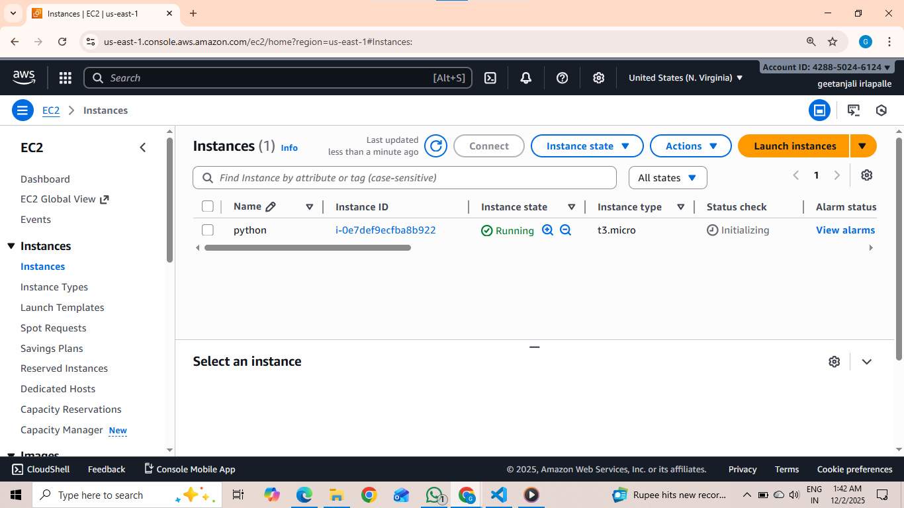
   
  2. Copy the SSH command

  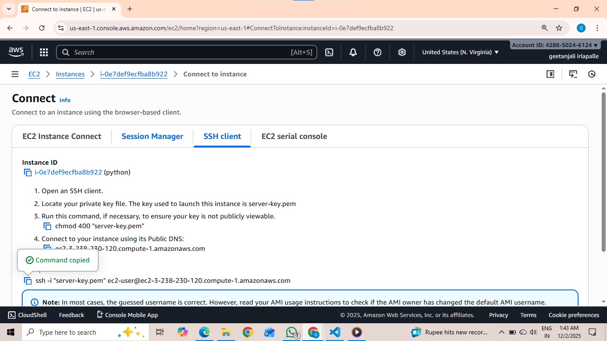
   
  3. Paste command in Git bash 
  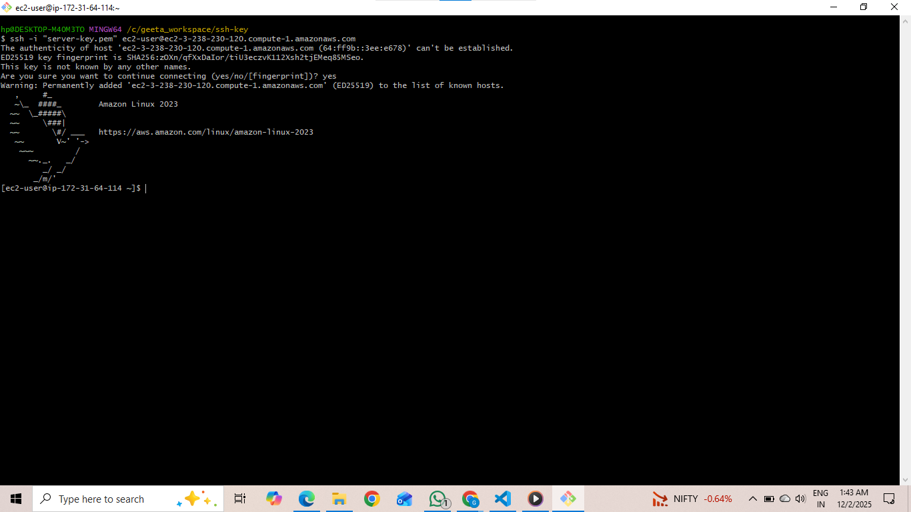
   
# Step 2: Update Packages and Install Python
   # update 
    sudo yum update 

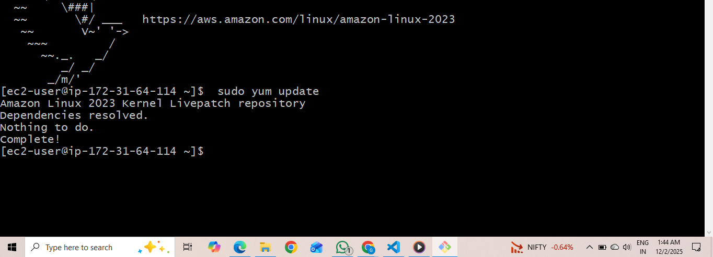
 
# install python 
    sudo yum install python3 -y 
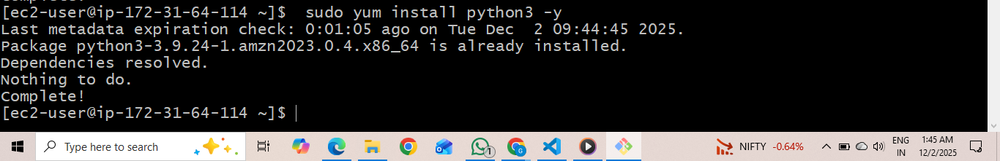
 
# install pip 
    sudo yum install python3-pip 
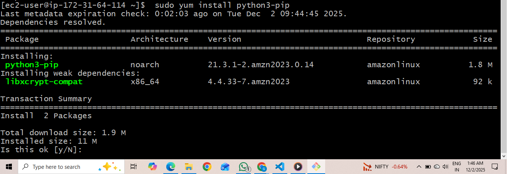
 
# Step 3: Upload/Clone Your Application
 1. Install git
 sudo yum install git -y 

 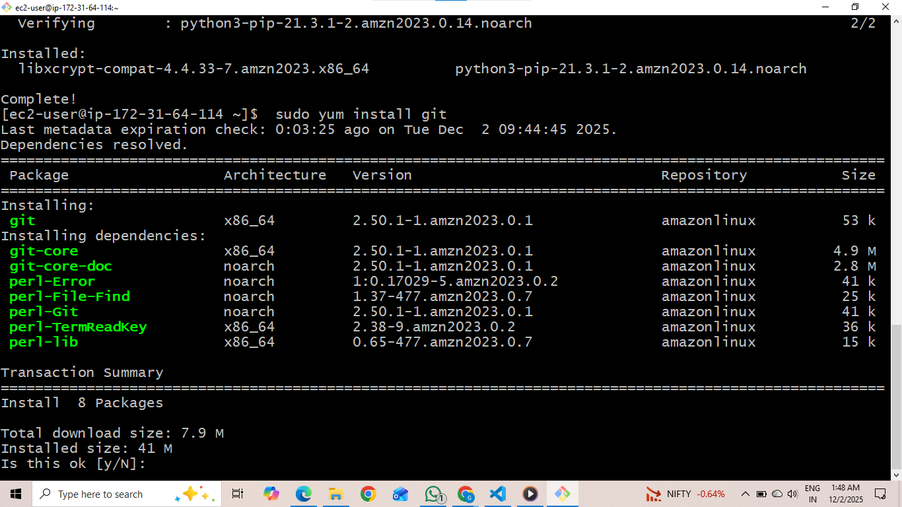
  
2. Clone the Application and go inside the project folder (pythonapp)
 # clone git application 
git clone <git url> 
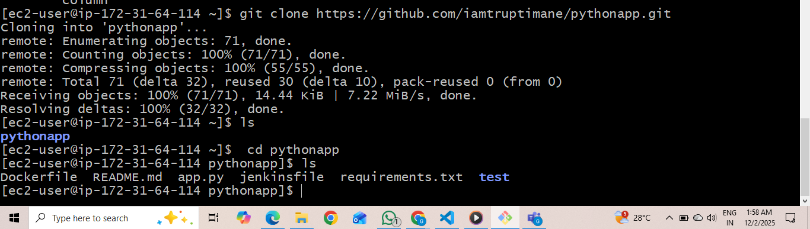
 
# Go inside the projrct folder
 cd pythonapp
 
  
 # Step 4: Create a virtual environment and run activate file.
 
 # create virtual environment 
sudo python3 -m venv myenv 
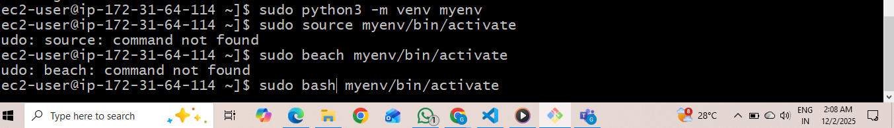
# activate file 
sudo source myenv/bin/activate

# Step 5: Install Dependency.
 sudo pip install -r requirement.txt
 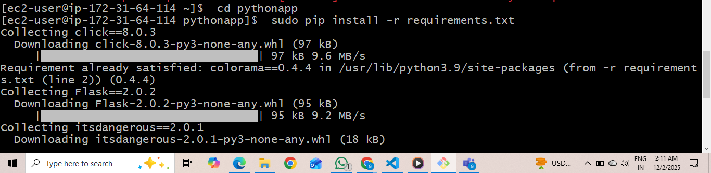
 # Step 6: Keep the App Running on background.
 sudo gunicorn --bind 0.0.0.0:5000 
 <file_name>:app -- daemon
 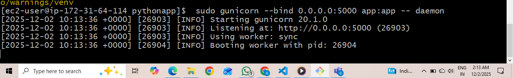

# Step 7: Create Proxy Server
 1. Configuring Nginx as Proxy.
 sudo yum install nginx

 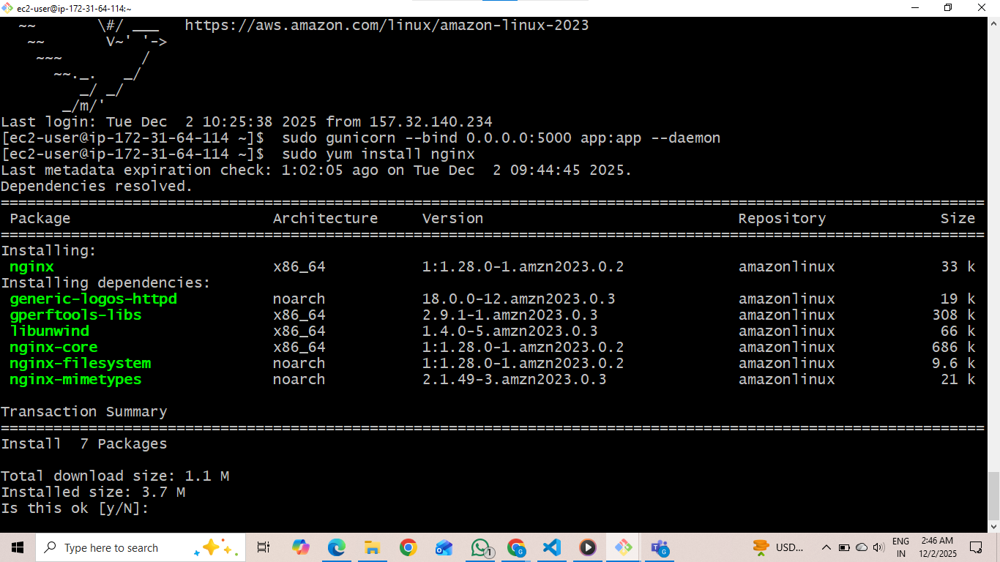
  2. Start, enable and check status of nginx
 sudo systemctl start nginx 
sudo systemctl enable nginx 
sudo systemctl status nginx
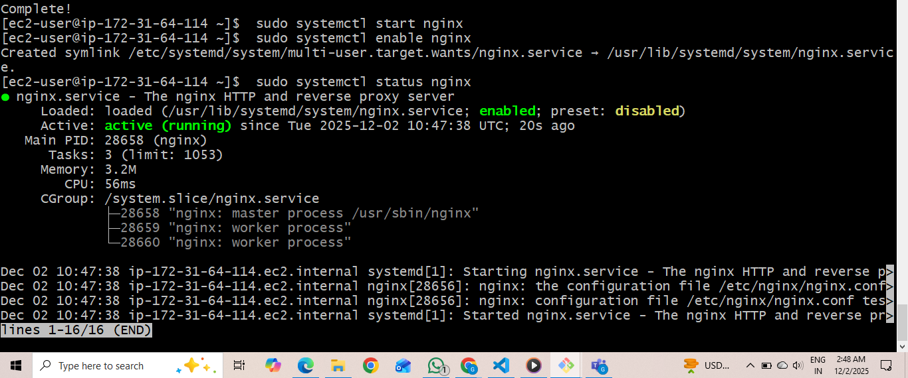
3. Create a server block for your app
 1. open nginx.conf
 sudo vim nginx.conf
 
  2. Edit and add server block 
  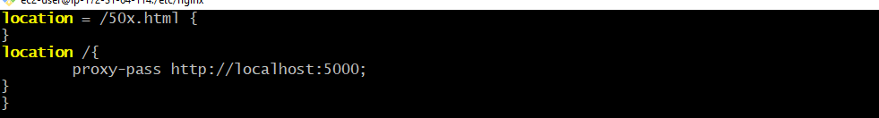
# Step 8: Testing the Deployment
 Copy the public IP and paste it in any browser. 
 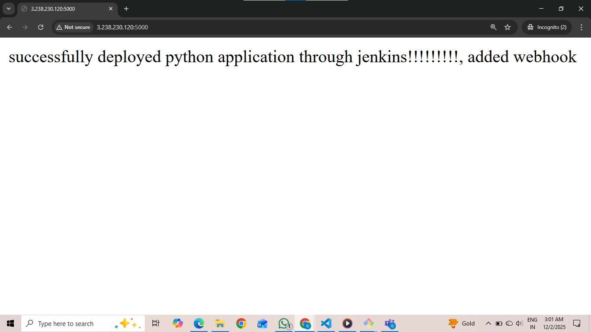